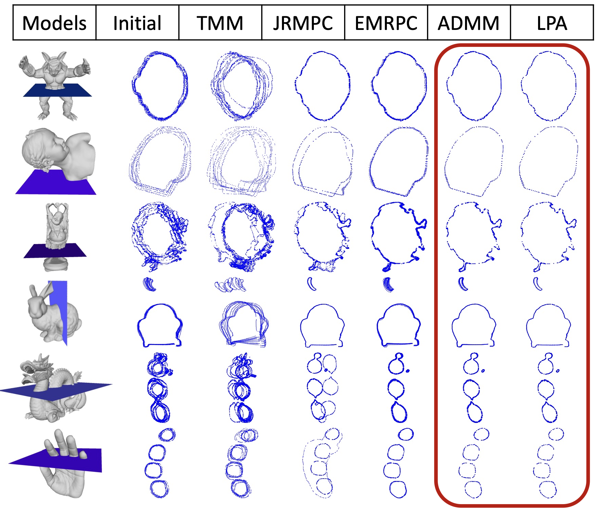
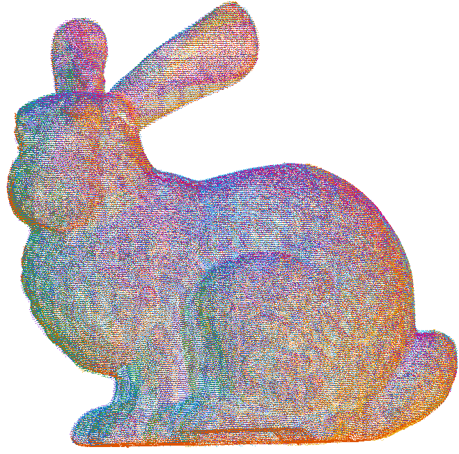
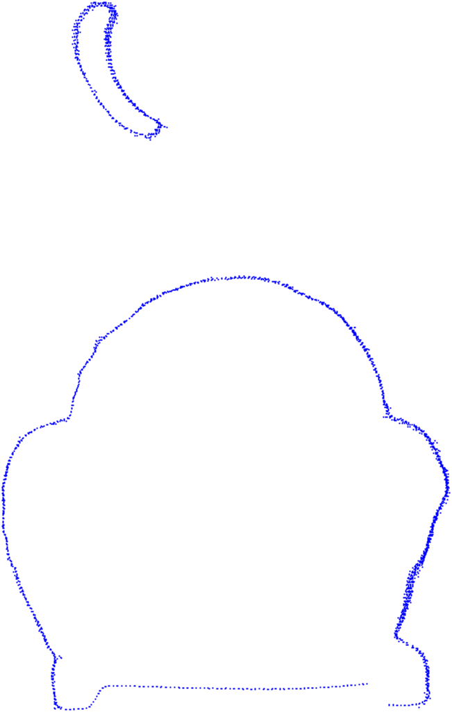

# Robust Multi-view Registration of Point Sets with Laplacian Mixture Model



MATLAB implementation of our ACPR 2021 paper
([Springer](https://link.springer.com/book/10.1007/978-981-95-4395-3)). Given
several partially overlapping 3D point sets, we recover the rigid pose of each
view so they align into a single model — robustly, under heavy noise and
outliers.

Unlike Gaussian-mixture methods (L2, outlier-sensitive), we model each point
with a **Laplacian Mixture Model**: its centers are the corresponding points in
the *other* views. The heavy-tailed, sparsity-inducing **L1** likelihood absorbs
outliers without any extra uniform component. Parameters and transformations are
solved by **EM** — an E-step that builds L1 nearest-neighbour correspondences,
and an M-step that solves a per-view weighted least-absolute-value (WLAV)
alignment with two interchangeable solvers:

- **ADMM** (`'admm'`, default) — variable splitting, soft-thresholding + SVD; fast.
- **LPA** (`'lpa'`) — exponential-map linearization → LP → interior point; most accurate.

## Quick start

```matlab
>> demo        % registers the 10 Bunny views, prints errors, shows the result
```

The demo produces two figures — the 3-D synthesized model (each view a distinct
colour) and a cross-section through it. Switch solver at the top of `demo.m`.

| 3-D synthesized model | Cross section |
| :-------------------: | :-----------: |
|  |  |

On your own data:

```matlab
addpath(genpath('src'));
% views{i} : 3 x Ni points of view i in a common (initial) frame
% Ts       : 4 x 4 x M initial transformations
% ns{i}    : createns(raw_view_i, 'NSMethod','kdtree', 'Distance','cityblock')
[Ts_est, info] = register_lmm(views, Ts, ns, struct('solver','admm'));
```

> **Scale.** The Laplacian scale starts at `b = 1`, so keep coordinates roughly
> unit-scale (the demo divides the raw Bunny by 1000). Rotation is
> scale-invariant; translation simply rescales back.

## Layout

```
demo.m                 end-to-end demo on the Stanford Bunny
data/bunny.mat         10 partial views (noise + outliers) + ground truth
src/register_lmm.m     main EM loop
src/solvers/           wlav_admm, wlav_lpa, wls_svd, l1_interior_point, cg_solve
src/utils/             pc_transform, inv_transform, skew, reg_error
src/vis/               build_aligned_model, cross_section
```

**Requirements:** MATLAB (tested on R2026a) + Statistics and Machine Learning Toolbox.

## Citation

```bibtex
@InProceedings{zhang2022robust,
  author    = {Zhang, Jin and Zhao, Mingyang and Jiang, Xin and Yan, Dong-Ming},
  title     = {Robust Multi-view Registration of Point Sets with Laplacian Mixture Model},
  booktitle = {Pattern Recognition: 6th Asian Conference, ACPR 2021},
  year      = {2022},
  publisher = {Springer International Publishing},
  pages     = {547--561},
  isbn      = {978-3-031-02444-3}
}
```

## Acknowledgements

The L1 interior point solver and conjugate gradient routine are adapted from
[l1-magic](https://candes.su.domains/software/l1magic/) (Justin Romberg, Caltech).
The Bunny data and evaluation setup follow the EMPMR reference implementation
[Macariaa/EMPMR](https://github.com/Macariaa/EMPMR); the model is from the
[Stanford 3D Scanning Repository](http://graphics.stanford.edu/data/3Dscanrep).

Released under the MIT License — see [LICENSE](LICENSE).
